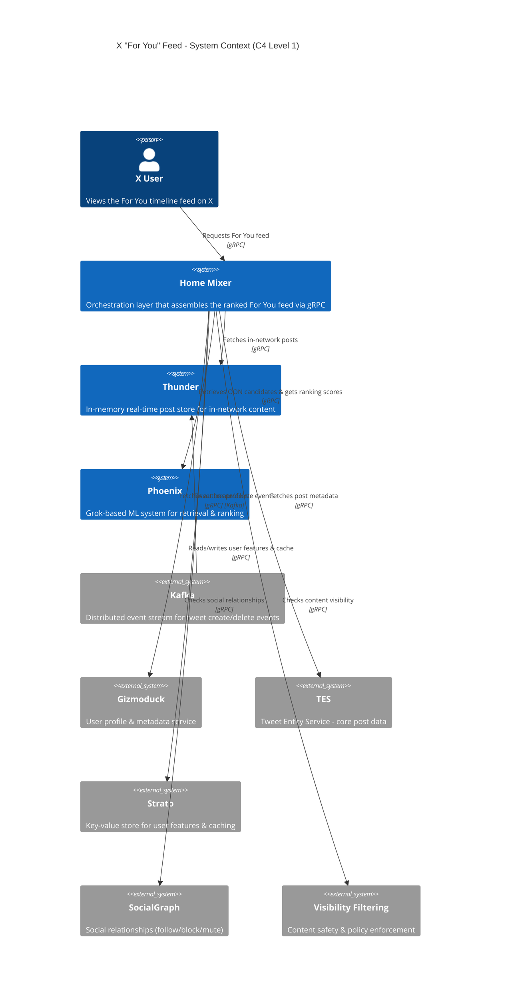

# C4 Context Diagram - X For You Feed System

**Navigation:** [Home](../index.md) · [Architecture](../ARCHITECTURE.md) · [Example Scenario](../EXAMPLE_SCENARIO.md) · [Pipeline Flow](pipeline-component-flow.md) · [Sequence](sequence-diagram.md) · [Phoenix ML](phoenix-ml-architecture.md) · [Thunder](thunder-architecture.md)

