# Home Mixer Pipeline - Component Flow

**Navigation:** [Home](../index.md) · [Architecture](../ARCHITECTURE.md) · [Example Scenario](../EXAMPLE_SCENARIO.md) · [C4 Context](c4-context.md) · [Sequence](sequence-diagram.md) · [Phoenix ML](phoenix-ml-architecture.md) · [Thunder](thunder-architecture.md)

```mermaid
graph TB
    subgraph HomeMixer["HOME MIXER - Candidate Pipeline Stages"]
        direction TB
        QH["1. Query Hydration<br/>───────────────<br/>• UserActionSeqQueryHydrator<br/>(engagement history)<br/>• UserFeaturesQueryHydrator<br/>(following list, muted keywords)"]
        
        SRC["2. Candidate Sources<br/>───────────────<br/>⚡ ThunderSource → In-Network Posts<br/>🔍 PhoenixSource → Out-of-Network Posts"]
        
        HYD["3. Candidate Hydration<br/>───────────────<br/>• InNetworkCandidateHydrator<br/>• CoreDataCandidateHydrator (TES)<br/>• VideoDurationHydrator<br/>• SubscriptionHydrator<br/>• GizmoduckHydrator (author info)"]
        
        FLT["4. Pre-Scoring Filters<br/>───────────────<br/>• DropDuplicates • CoreDataHydration<br/>• AgeFilter • SelfTweetFilter<br/>• RetweetDedup • IneligibleSubscription<br/>• PreviouslySeen • PreviouslyServed<br/>• MutedKeyword • AuthorSocialgraph"]
        
        SCR["5. Scoring Chain<br/>───────────────<br/>① PhoenixScorer → ML predictions<br/>② WeightedScorer → Σ(wi × Pi)<br/>③ AuthorDiversityScorer → decay repeats<br/>④ OONScorer → adjust OON weight"]
        
        SEL["6. Selection<br/>───────────────<br/>TopKScoreSelector<br/>Sort by score, pick top K"]
        
        PST["7. Post-Selection<br/>───────────────<br/>VFCandidateHydrator → safety check<br/>VFFilter → drop unsafe content<br/>DedupConversationFilter"]
        
        SFX["8. Side Effects<br/>───────────────<br/>CacheRequestInfoSideEffect<br/>(async, non-blocking)"]
        
        QH --> SRC --> HYD --> FLT --> SCR --> SEL --> PST --> SFX
    end

    style QH fill:#e8f5e9,stroke:#2e7d32
    style SRC fill:#e3f2fd,stroke:#1565c0
    style HYD fill:#fff3e0,stroke:#ef6c00
    style FLT fill:#fce4ec,stroke:#c62828
    style SCR fill:#f3e5f5,stroke:#6a1b9a
    style SEL fill:#e0f7fa,stroke:#00838f
    style PST fill:#fce4ec,stroke:#c62828
    style SFX fill:#f5f5f5,stroke:#616161
```

